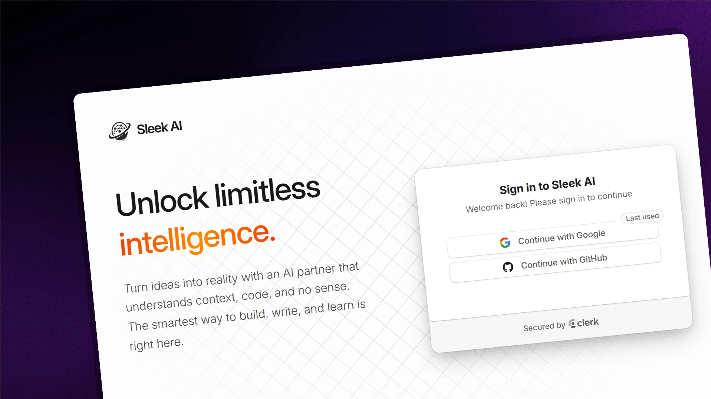
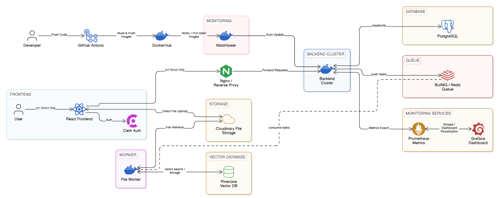

# Sleek AI



[](https://github.com/sunjay-dev/sleek-ai/actions/workflows/docker-build-push.yaml)
[](https://opensource.org/licenses/MIT)
[](https://github.com/sunjay-dev/sleek-ai/commits/main)

A full-stack AI chat application featuring real-time messaging, file ingestion, and vector search capabilities. Optimized for speed, reliability, and
seamless AI interactions.

## Features

- **AI Chat Interface**: Interactive chat with AI models.
- **File Ingestion**: Upload and process documents (PDF, Docx, TXT) for context-aware responses.
- **Vector Search**: Semantic search powered by Pinecone and Google Gemini embeddings.
- **Authentication**: Secure user authentication via Clerk.
- **Background Processing**: Asynchronous file processing with BullMQ workers.
- **Infrastructure**: Containerized development environment with Docker.

## Tech Stack


## Architecture



## Prerequisites

- **Bun.js** or **Node.js**
- **pnpm** (Package Manager)
- **Docker & Docker Compose**

## Installation & Setup

1.  **Clone the Repository**

    ```bash
    git clone https://github.com/sunjay-dev/sleek-ai.git
    cd sleek-ai
    ```

2.  **Install Dependencies**

    ```bash
    pnpm install
    ```

3.  **Environment Configuration**

    Copy the `.env.example` files to `.env` in `backend` and `worker` directories and fill in your secrets.

    ```bash
    cp backend/.env.example backend/.env
    cp worker/.env.example worker/.env
    ```

4.  **Start Infrastructure (Redis/Postgres)**

    ```bash
    docker-compose up -d redis
    # Ensure your local Postgres is running or add it to docker-compose
    ```

5.  **Database Migration**

    ```bash
    pnpm --filter @app/backend run prisma:migrate
    ```

6.  **Run Development Servers**
    ```bash
    pnpm dev
    ```
    This will start the specialized dev scripts defined in the root `package.json`.

## Project Structure

This is a monorepo containing:

- **`frontend/`**: Vite-based React application with Tailwind CSS and Shadcn UI.
- **`backend/`**: Hono.js API server handling chat logic, authentication, and job dispatching.
- **`worker/`**: BullMQ-based background worker for processing file metadata and vector embeddings.
- **`shared/`**: Shared TypeScript types and utility functions used across packages.

## Contribution

See [CONTRIBUTING.md](./CONTRIBUTING.md) for guidelines on how to contribute to this project.
